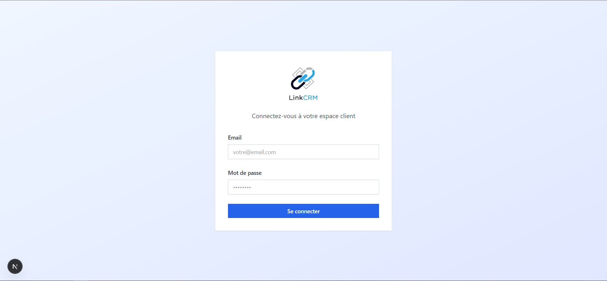
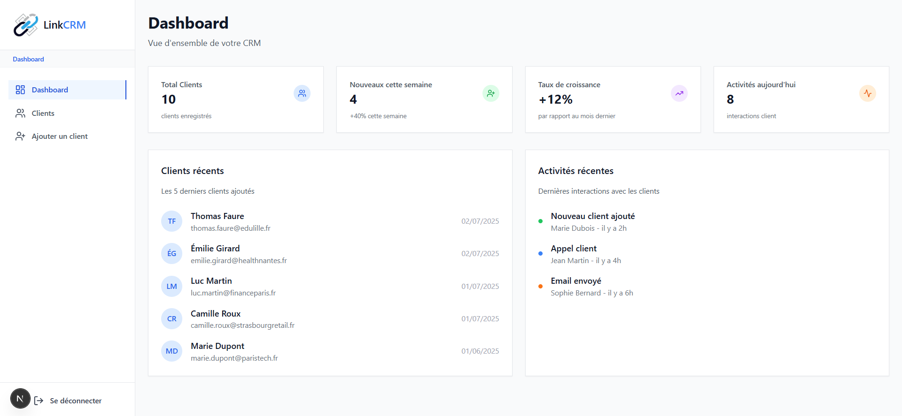
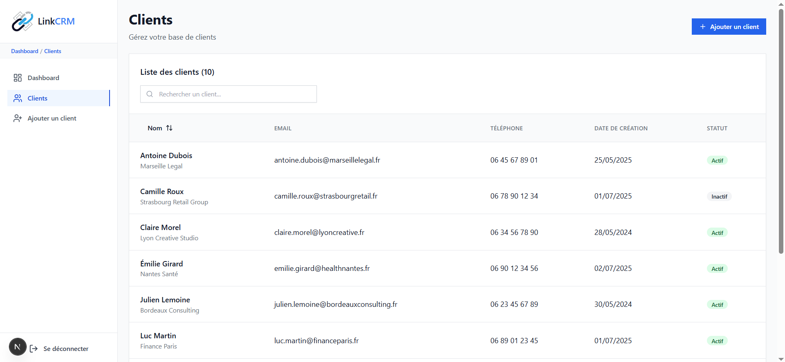
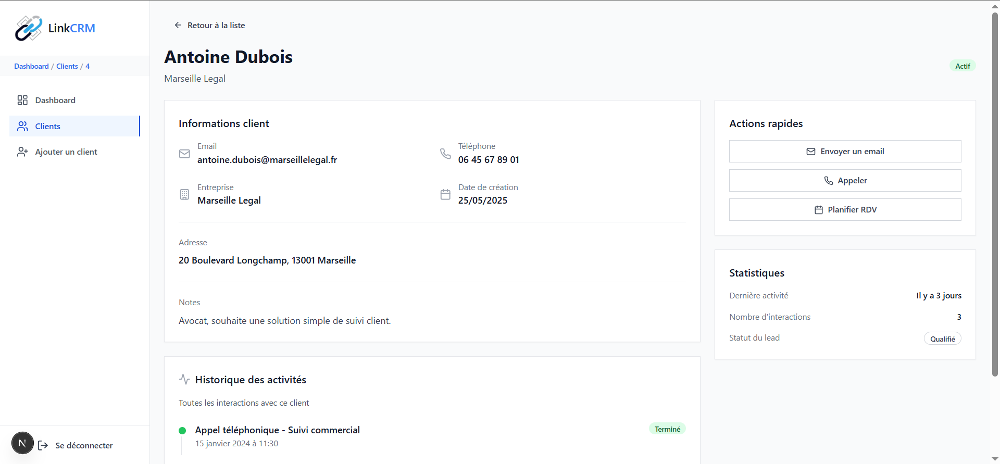
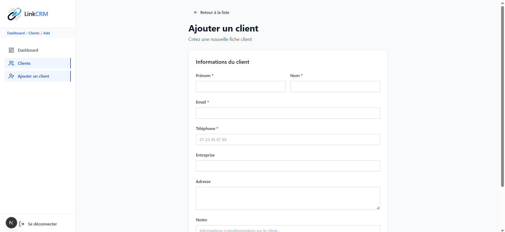

Here is the **full English version** of your README with natural wording (good for GitHub / portfolio):

---

# LinkCRM - Client Management Application

**LinkCRM** is a modern CRM application designed to help sales teams easily manage their clients. Built with **Next.js, TypeScript, and Tailwind CSS**, it offers an intuitive and responsive interface with all the essential features needed to track contacts and client interactions efficiently.

---

# Project Structure

```
├── app/
│   ├── login/
│   │   └── page.tsx              # Login page (mock)
│   ├── dashboard/
│   │   ├── layout.tsx            # Layout with sidebar
│   │   ├── page.tsx              # Main dashboard
│   │   └── clients/
│   │       ├── page.tsx          # Client list
│   │       ├── add/page.tsx      # Add client form
│   │       └── [id]/page.tsx     # Detailed client profile
├── components/
│   ├── Navbar.tsx                # Main navigation
│   ├── ClientTable.tsx           # Client table with search/sort
│   ├── ClientForm.tsx            # Add client form
│   ├── ClientCard.tsx            # Detailed client profile
│   └── Layout.tsx                # Layout wrapper
├── data/
│   └── mock.ts                   # Mock data (10 clients)
├── styles/
│   └── globals.css               # Global styles + CSS variables
├── types/
│   └── client.ts                 # TypeScript types
├── utils/
│   └── validation.ts             # Validation functions
└── README.md
```

---

# Features

## Core Features

### 1. Login Page (Mock)

* Responsive interface without backend validation
* Automatic redirect to the dashboard

### 2. Dashboard

* Overview with key statistics
* Metric cards (total clients, new clients, growth)
* List of recent clients
* Activity history

### 3. Client List

* Responsive table displaying **10 mock clients**
* **Real-time search** (name, email, phone)
* **Sorting by name** (ascending/descending)
* Columns: name, email, phone, creation date, status
* Navigation to detailed client profiles

### 4. Client Profile

* Complete client information
* Activity history with timeline
* Quick actions (email, call, meeting)
* Client statistics

### 5. Add Client Form

* Built with **React Hook Form** and validation
* **Required fields**: first name, last name, email, phone
* **Email and French phone number validation**
* Real-time error messages
* Success message with redirect

---

# Visual Preview

**Login Page**



**Main Dashboard**



**Client List**



**Client Details**



**Add Client**



---

# Visual Identity & Custom UI

* Professional logo integrated across the interface
* Custom UI components built **from scratch** (buttons, inputs, badges, cards, etc.)
* Consistent color palette using CSS variables
* **Lucide React icons** for a modern experience
* **Mobile-first responsive design**

---

# Tech Stack

* **Framework:** Next.js 14 (App Router)
* **Language:** TypeScript
* **Styling:** Tailwind CSS
* **Forms:** React Hook Form
* **Icons:** Lucide React
* **Data:** Static mock data

---

# Installation & Setup

### 1. Clone the repository

```bash
git clone https://github.com/badie16/LinkCRM.git
cd LinkCRM
```

### 2. Install dependencies

```bash
npm install
```

### 3. Run the development server

```bash
npm run dev
```

### 4. Open the application

Visit:

```
http://localhost:3000
```

---

# Usage

## Login

* The login page is accessible from the root route
* Enter any email/password (mock authentication)
* Automatic redirect to the dashboard

## Navigation

* **Responsive sidebar** with hamburger menu on mobile
* **Dashboard:** Overview with statistics
* **Clients:** Full list with search and sorting
* **Add Client:** Form to create a new client

---

# Client Management

### Search

Real-time filtering by:

* Name
* Email
* Phone

### Sorting

Click on **"Name"** to sort alphabetically.

### Client Details

Click on a row to view the full client profile.

### Add Client

Create a new client using the form with required field validation.

---

# Data & Validation

### `data/mock.ts`

* 10 mock French clients
* Realistic data (names, companies, addresses)
* Active/inactive statuses
* Various creation dates

### `utils/validation.ts`

* Email validation (regex)
* French phone number validation
* Date formatting
* Utility formatting helpers

### `types/client.ts`

* Full `Client` interface
* `ClientFormData` type for forms
* `Activity` interface for client history

---

# Implementation Highlights

1. **Professional logo** integrated across the UI
2. **Custom UI components** built from scratch
3. **Clean architecture** following best practices
4. **Well-typed TypeScript code**
5. **Robust validation** with clear error messages
6. **Fully responsive interface** for all screen sizes
7. **Realistic data** for a convincing demonstration
8. **Intuitive navigation** with active states
9. **Optimized performance** using Next.js App Router
10. **Custom CSS system** with variables and animations
11. **Authentic development** without external UI libraries
12. **Consistent icon system** using Lucide React

---

If you want, I can also help you **make this README more attractive for GitHub (with badges, demo link, tech icons, and portfolio-ready format)** so it looks **more professional when clients see your repo.**
